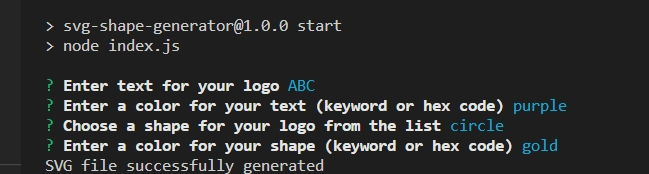

# SVG-Shape-Generator
An app that will create an SVG file to render various shapes of colors and texts based on the user's inputs.

A sample SVG file can be view [here](./img/generated-logo-sample.svg)

A video demo of the app can be found [here](https://drive.google.com/file/d/1OIaA_f48S9_LrMK0eQpl6ZGprkc5WNhu/view)

## Screenshot

## Features

- Built with Node, inquirer, Jest
- User can input up to 3 letters and choose from one of the three provided shapes for their logo
- They can then input the colors for both the text and shape, using basic color words or hex codes

## Table of Contents 

* [Installation](#installation)

* [Usage](#usage)

* [License](#license)

* [Contributing](#contributing)

* [Tests](#tests)

* [Questions](#questions)

## Installation

To install necessary dependencies, run the following command:
~~~
npm i
~~~
## Usage

Perform a git clone and run the code with "npm start"

## License

MIT

## Contributing

Fork the repo and create pull requests

## Tests

To run tests, run the following command:
~~~
npm test
~~~
## Questions

If you have any questions about the repo, open an issue or contact me directly at Algarvian2001@yahoo.com. You can find more of my works at [NganPham89](https://github.com/NganPham89).

